# AI Blog Writing Agent

An end-to-end AI-powered blog generation system that researches a topic, creates a structured plan, writes section-wise content using a LangGraph workflow, generates contextual images, and stores the final result for future access.

The project combines a **LangGraph + LangChain backend** with a **React + TypeScript frontend**, uses **Azure PostgreSQL** for blog persistence, **Azure Blob Storage** for generated images, and is fully deployed on **Microsoft Azure**.

---

## Demo

### Full Demo Video
A complete blog generation run from topic submission to final saved blog with streaming progress updates, generated images, and all result tabs. \

Running on Azure Web App url


---

## The Blog Writing Agent Workflow

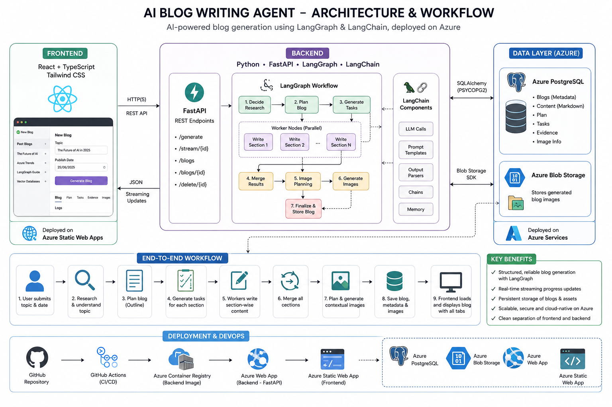

The Blog Writing Agent takes a blog topic and generates a complete blog through a multi-step workflow:

1. **Research / topic understanding**
2. **Structured blog planning**
3. **Task creation for section-wise content generation**
4. **Section writing through LangGraph workflow nodes**
5. **Merging and final blog assembly**
6. **Image planning + image generation**
7. **Saving final blog, metadata, and image information**
8. **Loading past blogs from storage through the frontend**

The frontend provides a streaming experience during generation and lets the user inspect the final output through dedicated tabs for blog content, plan, evidence, images, and logs.

---

## Key Features

- **End-to-end AI blog generation pipeline**
- **LangGraph workflow orchestration** for planning, tasking, content generation, merge, and image flow
- **Streaming progress updates** while the blog is being generated
- **Persistent storage of generated blogs** in Azure PostgreSQL
- **Generated image storage** in Azure Blob Storage
- **Multi-tab blog interface** for final blog, plan, evidence, images, and logs
- **Saved blog history** with ability to reopen previously generated blogs
- **Cloud deployment on Azure** with separate frontend, backend, database, and storage services

---

## Application Walkthrough

### Blog Output
Final generated blog rendered in the UI with markdown content and generated images.

<p align="center">
  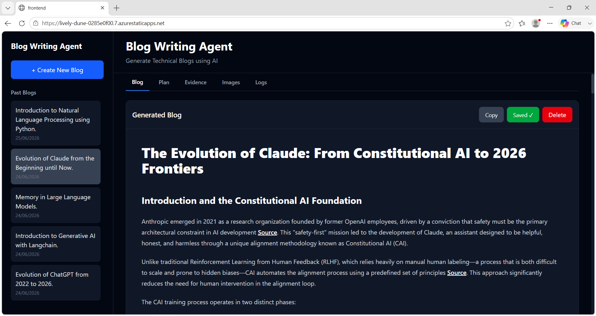
</p>

### Other Tabs
The interface also exposes the internal outputs of the workflow through separate tabs for planning, evidence, generated images, and logs.

<table>
  <tr>
    <td align="center"><b>Plan</b></td>
    <td align="center"><b>Evidence</b></td>
  </tr>
  <tr>
    <td>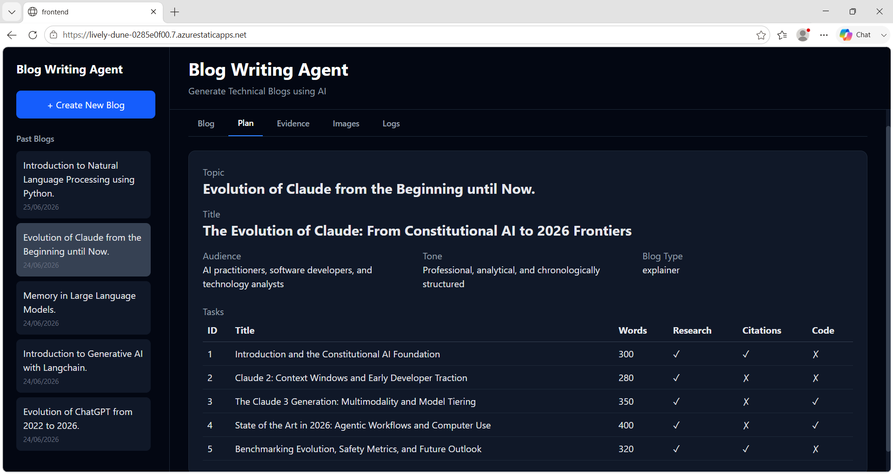</td>
    <td>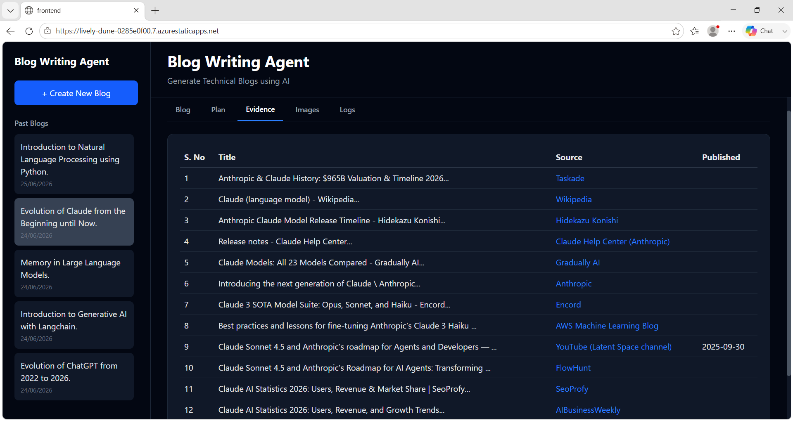</td>
  </tr>
  <tr>
    <td align="center"><b>Images</b></td>
    <td align="center"><b>Logs</b></td>
  </tr>
  <tr>
    <td>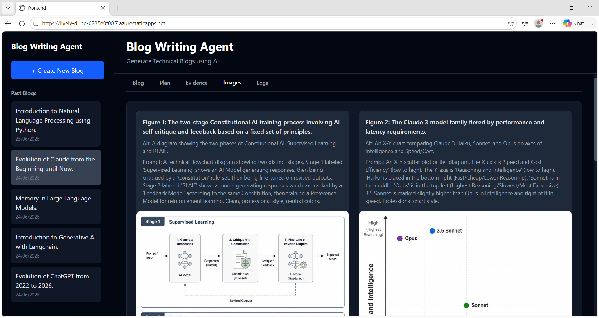</td>
    <td>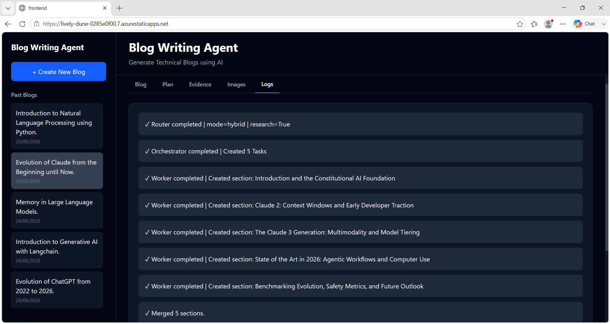</td>
  </tr>
</table>

---

## System Architecture

The project is built as a full-stack application with a workflow-driven backend and a deployed frontend.

### High-Level Flow

1. **Frontend (React + TypeScript)** collects the blog topic and displays streaming progress + final results.
2. **FastAPI backend** receives the request and triggers the LangGraph workflow.
3. **LangGraph / LangChain workflow** handles planning, task generation, content writing, merging, and image planning.
4. **Azure Blob Storage** stores generated blog images.
5. **Azure PostgreSQL** stores blog metadata, final markdown, plans, evidence, and image information.
6. The frontend loads the saved blog back from the backend and displays it in the tabbed interface.

### Architecture Summary

- **Frontend**: React, TypeScript, Tailwind CSS
- **Backend API**: FastAPI
- **Workflow Engine**: LangGraph
- **LLM Orchestration / Chains**: LangChain
- **Database**: Azure PostgreSQL
- **Image Storage**: Azure Blob Storage
- **Deployment**: Azure App Service + Azure Static Web Apps + Azure Container Registry + GitHub Actions

---

## Tech Stack

### Frontend
- React
- TypeScript
- Tailwind CSS
- Axios

### Backend
- FastAPI
- LangGraph
- LangChain
- Pydantic
- SQLAlchemy

### Storage / Cloud
- Azure PostgreSQL
- Azure Blob Storage
- Azure App Service
- Azure Static Web Apps
- Azure Container Registry
- GitHub Actions

---

## Deployment on Azure

The complete project is deployed on Microsoft Azure as a full-stack application.

### Azure Resource Overview
This project uses separate Azure resources for frontend hosting, backend hosting, database, and image storage.

<p align="center">
  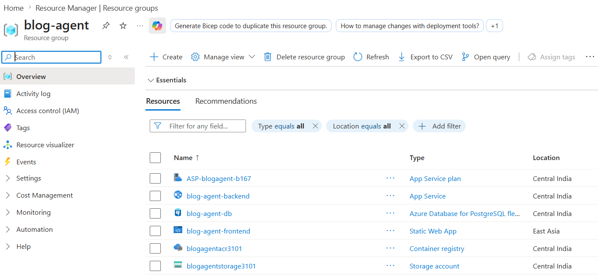
</p>

### Deployment Components

<table>
  <tr>
    <td align="center"><b>Backend (Azure App Service)</b></td>
    <td align="center"><b>Frontend (Azure Static Web App)</b></td>
  </tr>
  <tr>
    <td>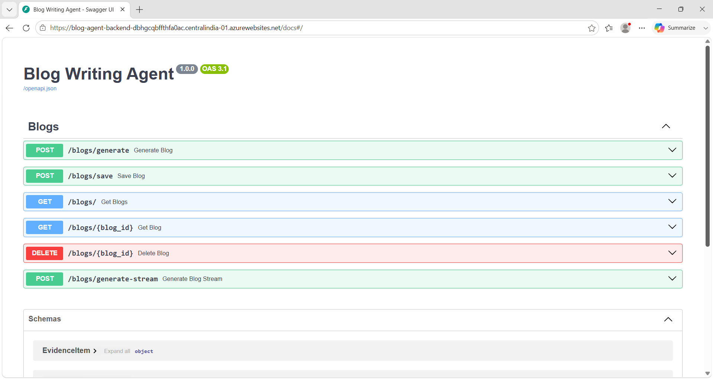</td>
    <td>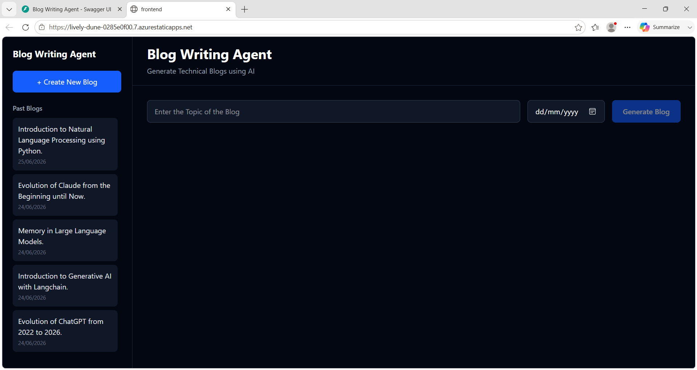</td>
  </tr>
  <tr>
    <td align="center"><b>Azure PostgreSQL</b></td>
    <td align="center"><b>Azure Blob Container</b></td>
  </tr>
  <tr>
    <td>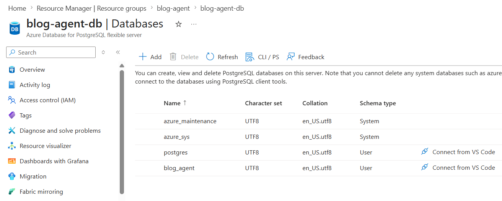</td>
    <td>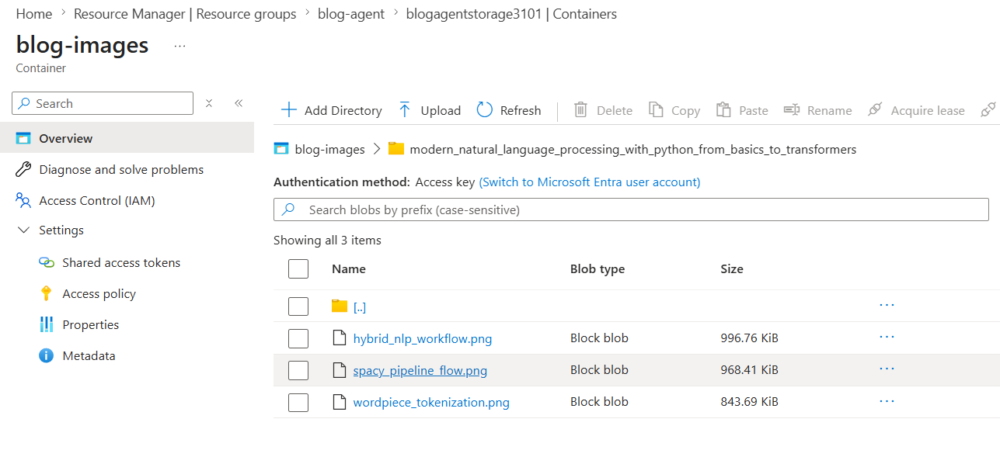</td>
  </tr>
</table>

### Deployment Summary
- **Frontend** deployed on **Azure Static Web Apps**
- **Backend** containerized and deployed on **Azure App Service**
- **Blog data and metadata** stored in **Azure PostgreSQL**
- **Generated images** stored in **Azure Blob Storage**
- **Container images** pushed through **Azure Container Registry**
- **GitHub Actions** used for deployment automation

---

## Repository Structure

```text
.
├── backend/      # FastAPI backend, LangGraph workflow, DB models/services
├── frontend/     # React + TypeScript frontend UI
├── src/          # Demo assets used in README (screenshots/video)
└── README.md
```

---

## Possible Improvements

- Add authentication and user-specific blog workspaces.
- Support non-technical blogs better with richer image sourcing beyond only generated images.
- Add resume / recovery for failed blog generation runs.
- Add a human-in-the-loop approval step after plan generation.
- Add iterative blog editing and refinement after the first draft.

---

## Notes

This repository focuses on the full workflow of **AI-assisted blog generation**, from planning and content creation to generated images, storage, and cloud deployment.

If you want to explore implementation details further:
- backend-specific setup and workflow notes can live in `backend/README.md`
- frontend-specific setup and UI notes can live in `frontend/README.md`
