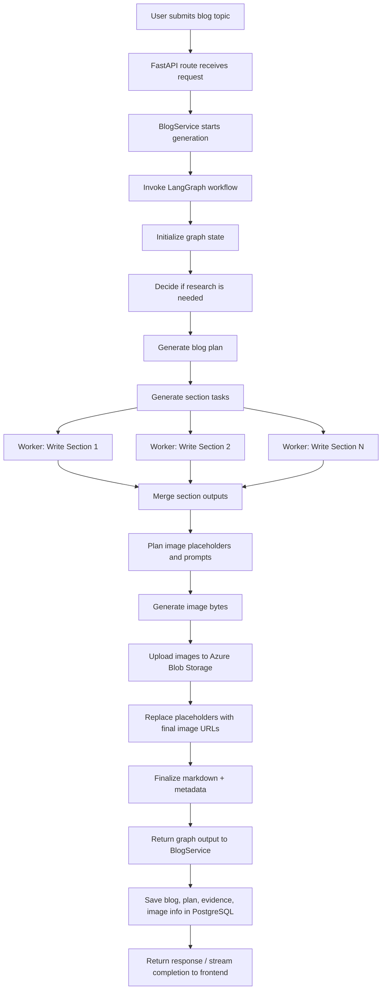

# Backend — AI Blog Writing Agent

This backend powers the **AI Blog Writing Agent** application. It exposes FastAPI APIs for blog generation and blog retrieval, runs the **LangGraph-based blog generation workflow**, stores blog data in **PostgreSQL**, and uploads generated blog images to **Azure Blob Storage**.

The backend is designed in a modular way with separate layers for:

* **API layer** → FastAPI routes
* **Service layer** → orchestration between API, LangGraph workflow, repositories, and storage
* **Repository / DB layer** → PostgreSQL access via SQLAlchemy
* **Graph layer** → LangGraph workflow for planning, research, writing, merging, image generation, and finalization
* **Blob storage integration** → upload generated images and persist public image URLs

---

# Backend Overview

At a high level, the backend does the following:

1. Accepts a blog generation request from the frontend.
2. Runs a **LangGraph workflow** to:

   * decide whether research is needed
   * create a blog plan
   * generate section-level tasks
   * run writing/research workers
   * merge content
   * plan and generate images
   * produce final markdown
3. Saves the generated blog, plan, evidence, and image metadata in **PostgreSQL**.
4. Uploads generated images to **Azure Blob Storage** and stores their URLs.
5. Exposes APIs to fetch saved blogs, list blog history, and delete blogs.

---

# Tech Stack

## Core Backend Stack

* **FastAPI** — API layer
* **LangGraph** — graph orchestration for blog generation
* **LangChain** — LLM integrations, prompt chains, and structured outputs
* **SQLAlchemy** — PostgreSQL ORM / DB access
* **Pydantic** — request/response and graph schemas
* **Azure Blob Storage SDK** — generated image storage
* **uv / uvicorn** — local dependency management and app serving

---

# Project Structure

```text
backend/
├── .dockerignore
├── .env
├── .env.example
├── .gitignore
├── .python-version
├── Dockerfile
├── pyproject.toml
├── requirements.txt
├── README.md
└── app/
    ├── main.py
    │
    ├── api/
    │   └── blogs.py
    │
    ├── core/
    │   └── config.py
    │
    ├── db/
    │   ├── dependencies.py
    │   ├── init_db.py
    │   ├── models.py
    │   ├── repositories.py
    │   ├── session.py
    │   └── test_db.py
    │
    ├── graph/
    │   ├── blog_graph.py
    │   ├── blog_graph_old.py
    │   ├── prompts.py
    │   ├── schemas.py
    │   ├── subgraph.py
    │   └── utils.py
    │
    ├── schemas/
    │   └── blog.py
    │
    └── services/
        ├── blob_storage_service.py
        └── blog_service.py
```

---

# Layered Architecture

## 1) API Layer — `app/api/`

### File

* `app/api/blogs.py`

This layer exposes the HTTP endpoints consumed by the frontend.

Typical responsibilities:

* accept incoming blog generation / retrieval requests
* validate request payloads
* call the service layer
* return API responses / streaming responses

Example responsibilities in this project:

* generate a blog
* stream generation events
* list saved blogs
* fetch a blog by ID
* delete a blog

The API layer should stay thin and avoid containing business logic.

---

## 2) Service Layer — `app/services/`

### Files

* `app/services/blog_service.py`
* `app/services/blob_storage_service.py`

The service layer contains backend application logic that sits between the API and lower-level infrastructure.

## `blog_service.py`

This is the main orchestration layer for blog-related operations. It typically handles:

* invoking the LangGraph workflow
* translating graph output into a DB-ready structure
* saving blogs through repository functions
* loading saved blogs
* deleting blogs
* coordinating with blob storage where needed

In other words, the API route should call the **blog service**, and the blog service decides how to:

* run the graph
* persist results
* return the correct response structure

## `blob_storage_service.py`

Responsible for Azure Blob Storage operations, such as:

* uploading generated image bytes
* creating blob paths / filenames
* returning public blob URLs
* optionally deleting or replacing blobs if needed later

This keeps storage logic out of the graph and out of the API layer.

---

## 3) Repository / DB Layer — `app/db/`

### Files

* `session.py`
* `models.py`
* `repositories.py`
* `dependencies.py`
* `init_db.py`
* `test_db.py`

This layer handles PostgreSQL access and persistence.

## `session.py`

Defines the SQLAlchemy engine and session factory.

Responsibilities:

* create DB engine from `DATABASE_URL`
* create `SessionLocal`
* expose DB session creation utilities

## `models.py`

Contains the SQLAlchemy ORM models for persisted blog data.

Typical stored data in this project includes:

* blog metadata (title, topic, created date, etc.)
* final markdown content
* plan
* tasks / evidence / logs
* image metadata / image URLs

## `repositories.py`

This is the repository layer for database access.
Instead of calling SQLAlchemy queries directly from the service or API layer, repository functions centralize database operations such as:

* create blog
* fetch all blogs
* fetch blog by ID
* delete blog
* update blog fields if needed

This gives cleaner separation between:

* **business logic** (service layer)
* **storage logic** (repository layer)

## `dependencies.py`

Provides FastAPI DB dependencies such as `get_db()`.

## `init_db.py`

Used to initialize / create database tables locally or against the configured PostgreSQL database.

## `test_db.py`

Used for DB connection / verification checks.

---

## 4) Graph Layer — `app/graph/`

### Files

* `blog_graph.py`
* `subgraph.py`
* `schemas.py`
* `prompts.py`
* `utils.py`

This is the core of the backend.
It contains the **LangGraph workflow** that transforms a blog request into a saved blog with images and metadata.

---

# LangGraph Workflow

The graph is responsible for turning a topic into a complete blog. It is implemented in a modular way so that graph state, prompts, helper utilities, and subgraph worker logic are separated into different files.

---

# Graph Modules

## `blog_graph.py`

This is the main graph definition file.

Responsibilities typically include:

* defining the main graph state
* registering graph nodes
* wiring node transitions / conditional edges
* compiling the final graph app

This file acts as the **entry point of the workflow**.

---

## `subgraph.py`

Contains the section-level or worker-level generation logic used inside the main workflow.

This is useful when:

* each section of the blog needs similar generation logic
* worker nodes operate in parallel / semi-parallel
* section generation logic should be isolated from the top-level orchestration graph

Examples of logic that may live here:

* section writing workers
* worker-specific image or evidence handling
* reusable worker flow for one section

---

## `schemas.py`

Contains Pydantic / typed schema definitions used inside the graph.

Typical graph schemas include:

* graph state models
* plan/task/evidence/image spec schemas
* structured output formats returned by LLM calls

This is important because the graph passes structured state between nodes.

---

## `prompts.py`

Stores prompt templates used by the workflow, such as prompts for:

* deciding if research is needed
* generating the blog plan
* generating section tasks
* writing section content
* planning images
* generating alt text / captions / image prompts

Keeping prompts separate from graph logic makes iteration much easier.

---

## `utils.py`

Contains helper utilities used by the graph, such as:

* markdown utilities
* filename / slug helpers
* parsing / formatting helpers
* image placeholder handling
* smaller reusable functions used across graph nodes

---

# LangGraph Workflow — Conceptual Flow

The exact implementation details can vary over time, but the current backend follows a workflow like this:

1. **Start with blog request**

   * user provides topic (and optional date/context)
   * initial graph state is created

2. **Decide whether research is needed**

   * the graph decides if the topic needs external research / deeper exploration

3. **Create blog plan**

   * generate a high-level outline / sections for the blog

4. **Generate section tasks**

   * convert the plan into section-level writing tasks

5. **Run worker nodes for section generation**

   * each worker writes one or more blog sections
   * evidence / logs / intermediate outputs are accumulated

6. **Merge section outputs**

   * combine worker outputs into one blog draft

7. **Plan images**

   * determine where images should appear in the blog
   * generate image prompts, alt text, captions, filenames

8. **Generate / upload images**

   * create image bytes
   * upload them to Azure Blob Storage
   * store public blob URLs
   * replace placeholders in markdown with final image markdown

9. **Finalize blog**

   * produce final markdown and structured metadata
   * return the result to the service layer

10. **Persist blog**

    * service layer stores the blog and metadata in PostgreSQL

---

# LangGraph Flowchart



---

# End-to-End Request Flow

## Blog generation request

When the frontend triggers a new blog generation:

1. **Frontend** calls the blog generation API.
2. **FastAPI route** forwards the request to `BlogService`.
3. **BlogService** invokes the compiled LangGraph app.
4. **LangGraph** executes the full generation workflow.
5. **Blob storage service** uploads generated images and returns blob URLs.
6. **BlogService / repository layer** saves the final result to PostgreSQL.
7. The frontend receives the saved blog ID / blog payload and can load the blog tabs.

---

# Image Handling Flow

Generated images are not stored locally in production.
Instead, the backend uploads them to **Azure Blob Storage** and stores the final public image URLs.

## Image flow

1. The graph creates **image specs** for the blog:

   * placeholder
   * prompt
   * alt text
   * caption
   * filename

2. Image generation produces image bytes.

3. `blob_storage_service.py` uploads those bytes to Azure Blob Storage.

4. Blob URLs are returned and written into:

   * final markdown
   * image metadata stored in PostgreSQL

5. The frontend renders those blob image URLs inside the final blog and images tab.

---

# PostgreSQL Persistence

The backend stores generated blog data in **PostgreSQL**.

Typical stored fields include:

* blog title / metadata
* final markdown
* plan
* evidence
* image metadata / URLs
* created timestamps

The DB layer is intentionally separated into:

* **models** for schema
* **repositories** for CRUD access
* **session / dependencies** for connection management

This makes the rest of the backend independent of raw SQLAlchemy query code.

---

# API Responsibilities

Although implementation details may evolve, the backend currently exposes blog-oriented endpoints such as:

* **Generate blog** / stream generation
* **List blogs**
* **Fetch blog by ID**
* **Delete blog**

The frontend should interact only with the API layer; it should never talk directly to the graph, database, or blob storage.

---

# Configuration

Configuration is managed through environment variables using `pydantic-settings`.

## Main configuration file

* `app/core/config.py`

Typical environment variables include:

* database connection string
* frontend URL for CORS
* backend base URL
* Azure Blob Storage connection settings
* LangChain / LLM API keys and tracing settings

See `.env.example` for the expected variables.

---

# Running the Backend Locally

## 1) Go to the backend folder

```bash
cd backend
```

## 2) Create a `.env` file

Copy the example file:

```bash
cp .env.example .env
```

Then fill in the required values such as:

* `DATABASE_URL`
* `FRONTEND_URL`
* Azure Blob Storage settings
* LLM / LangChain keys

> On Windows PowerShell, you can manually create `.env` using the contents of `.env.example` if `cp` is not available.

---

## 3) Install dependencies with `uv`

If you don’t already have `uv` installed, install it first.

Then create a virtual environment and sync dependencies:

```bash
uv venv
uv sync
```

This will create a local virtual environment and install the packages defined in `pyproject.toml`.

---

## 4) Activate the virtual environment

### Windows PowerShell

```bash
.venv\Scripts\activate
```

### macOS / Linux

```bash
source .venv/bin/activate
```

---

## 5) Initialize the database

Run the DB initialization script:

```bash
python app/db/init_db.py
```

This will create the required tables in the configured PostgreSQL database.

---

## 6) Run the FastAPI backend

```bash
uvicorn app.main:app --reload
```

By default, the backend will run at:

```text
http://127.0.0.1:8000
```

Swagger docs will be available at:

```text
http://127.0.0.1:8000/docs
```

---

# Running DB Connection Test

If you want to verify database connectivity separately, you can run:

```bash
python app/db/test_db.py
```

---

# Docker

The backend also includes a `Dockerfile` for containerized deployment.

Typical production deployment flow:

1. Build backend container image
2. Push image to container registry
3. Deploy image to Azure Web App
4. Configure environment variables in Azure App Service

---

# Notes

* `blog_graph_old.py` is an older graph version kept for reference and is not the primary workflow entry point.
* Local image saving may be used during development, but production image storage is handled through **Azure Blob Storage**.
* The graph structure may evolve over time, but the layered separation between **API → service → graph / repository / storage** remains the core backend design.

---
